# 📋 Diagrama de Casos de Uso - Futbol5Ya

Este diagrama representa las interacciones entre los actores del sistema y las funcionalidades disponibles.

```mermaid
flowchart TD
    Cliente(["👤 Cliente"])
    Admin(["🔧 Administrador"])

    subgraph Sistema["🖥️ Sistema Futbol5Ya"]

        subgraph Autenticacion["🔐 Autenticación"]
            CU1["Registrarse"]
            CU2["Iniciar sesión"]
            CU3["Cerrar sesión"]
        end

        subgraph GrillaDisponibilidad["📅 Disponibilidad"]
            CU4["Ver grilla de disponibilidad\npor día y cancha"]
        end

        subgraph GestionReservas["📌 Gestión de Reservas"]
            CU5["Realizar reserva\n(turno + fecha)"]
            CU6["Ver mis reservas"]
            CU7["Cancelar reserva"]
        end

        subgraph GestionCanchas["🏟️ Gestión de Canchas"]
            CU8["Agregar cancha"]
            CU9["Modificar cancha"]
            CU10["Eliminar cancha"]
            CU11["Activar / Desactivar cancha"]
        end

        subgraph GestionTurnos["🕐 Gestión de Turnos"]
            CU12["Agregar turno a una cancha"]
            CU13["Modificar turno"]
            CU14["Eliminar turno"]
            CU15["Habilitar / Deshabilitar turno"]
        end

        subgraph GestionUsuarios["👥 Gestión de Usuarios"]
            CU16["Ver listado de usuarios"]
            CU17["Ver reservas de un usuario"]
        end

    end

    %% Relaciones del Cliente
    Cliente --> CU1
    Cliente --> CU2
    Cliente --> CU3
    Cliente --> CU4
    Cliente --> CU5
    Cliente --> CU6
    Cliente --> CU7

    %% Relaciones del Administrador
    Admin --> CU2
    Admin --> CU3
    Admin --> CU4
    Admin --> CU8
    Admin --> CU9
    Admin --> CU10
    Admin --> CU11
    Admin --> CU12
    Admin --> CU13
    Admin --> CU14
    Admin --> CU15
    Admin --> CU16
    Admin --> CU17
```

---

## 👤 Actores del sistema

| Actor | Descripción |
|---|---|
| **Cliente** | Usuario registrado que puede ver la disponibilidad y gestionar sus propias reservas. |
| **Administrador** | Usuario con privilegios para gestionar canchas, turnos y visualizar información de todos los usuarios. |

---

## 📌 Descripción de Casos de Uso

### 🔐 Autenticación

| ID | Caso de Uso | Actor | Descripción |
|---|---|---|---|
| CU1 | Registrarse | Cliente | El usuario ingresa sus datos personales para crear una cuenta en el sistema. |
| CU2 | Iniciar sesión | Cliente / Admin | El usuario se autentica con email y contraseña. |
| CU3 | Cerrar sesión | Cliente / Admin | El usuario finaliza su sesión activa. |

### 📅 Disponibilidad

| ID | Caso de Uso | Actor | Descripción |
|---|---|---|---|
| CU4 | Ver grilla de disponibilidad | Cliente / Admin | Visualiza una grilla con las canchas disponibles, días de la semana y horarios libres u ocupados. |

### 📌 Gestión de Reservas

| ID | Caso de Uso | Actor | Descripción |
|---|---|---|---|
| CU5 | Realizar reserva | Cliente | Selecciona una cancha, un turno (día y horario) y una fecha para concretar la reserva. |
| CU6 | Ver mis reservas | Cliente | Consulta el historial y estado de sus reservas. |
| CU7 | Cancelar reserva | Cliente | Cancela una reserva previamente realizada. |

### 🏟️ Gestión de Canchas

| ID | Caso de Uso | Actor | Descripción |
|---|---|---|---|
| CU8 | Agregar cancha | Admin | Crea una nueva cancha con nombre, tipo y descripción. |
| CU9 | Modificar cancha | Admin | Edita los datos de una cancha existente. |
| CU10 | Eliminar cancha | Admin | Elimina una cancha del sistema. |
| CU11 | Activar / Desactivar cancha | Admin | Habilita o deshabilita una cancha para que aparezca en la grilla. |

### 🕐 Gestión de Turnos

| ID | Caso de Uso | Actor | Descripción |
|---|---|---|---|
| CU12 | Agregar turno a una cancha | Admin | Define un bloque horario (día + hora inicio + hora fin) para una cancha. |
| CU13 | Modificar turno | Admin | Edita el horario o día de un turno existente. |
| CU14 | Eliminar turno | Admin | Elimina un turno de una cancha. |
| CU15 | Habilitar / Deshabilitar turno | Admin | Marca un turno como disponible o no disponible. |

### 👥 Gestión de Usuarios

| ID | Caso de Uso | Actor | Descripción |
|---|---|---|---|
| CU16 | Ver listado de usuarios | Admin | Consulta todos los usuarios registrados en el sistema. |
| CU17 | Ver reservas de un usuario | Admin | Visualiza el historial de reservas de un usuario específico. |
