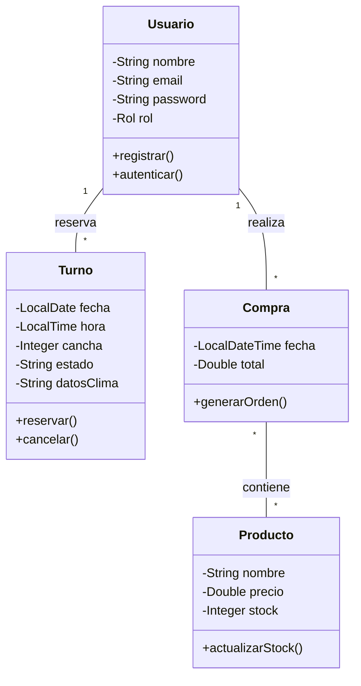

# 📊 Modelo de Clases - Futbol5Ya

Este diagrama representa la estructura lógica del sistema, incluyendo las entidades principales y la arquitectura de capas requerida.

---

## 🏛️ Descripción de la Arquitectura

El proyecto sigue una arquitectura de **sistemas distribuidos**, basada en una **API REST** y un cliente **Single Page Application (SPA)**, con separación clara de responsabilidades.

---

### ⚙️ Backend (Java + Spring Boot)

- **API REST:** Expone endpoints que devuelven datos en formato JSON.
- **Autenticación con JWT:** Uso de *JSON Web Tokens* para asegurar el acceso a recursos protegidos.
- **ORM con JPA/Hibernate:** Mapeo objeto-relacional entre entidades Java y tablas en MySQL.
- **Arquitectura en capas:** Separación en controladores, servicios y repositorios para mejorar la mantenibilidad y escalabilidad.

---

### 🎨 Frontend (React + TypeScript)

- **SPA (Single Page Application):** Interfaz dinámica que consume la API del backend sin recargar la página.
- **TypeScript:** Tipado estático para prevenir errores y mejorar la mantenibilidad del código.
- **Gestión de estado:** Manejo eficiente del estado de la aplicación (ej: Context API o librerías externas).
- **Componentización:** UI modular basada en componentes reutilizables.

---

### 🗄️ Persistencia

- **Base de datos relacional:** Uso de **MySQL** para el almacenamiento de datos.
- **Integración con JPA:** Abstracción de consultas mediante repositorios y entidades.

---
