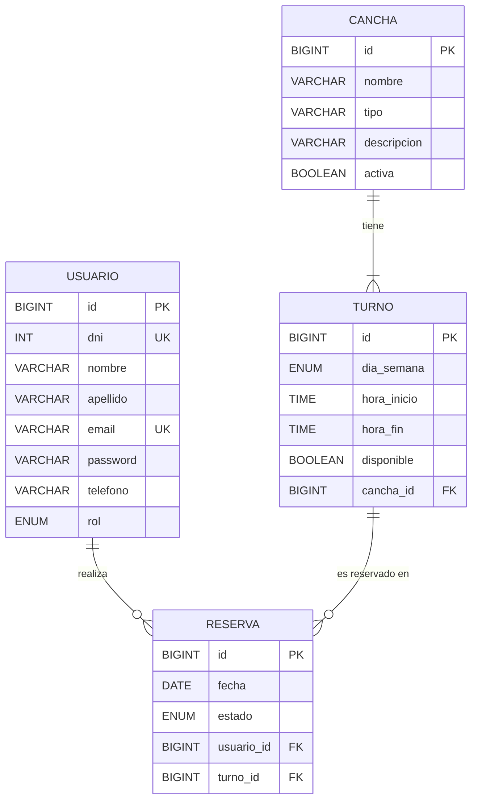

# 📊 Modelo Entidad-Relación - Futbol5Ya

---

## 📝 Descripción de entidades

### USUARIO
Representa a la persona que se registra en el sistema y puede realizar reservas.
- `rol`: puede ser `CLIENTE` o `ADMIN`.

### CANCHA
Representa cada cancha disponible en el complejo.
- `tipo`: por ejemplo `FUTBOL_5`, `FUTBOL_7`, `FUTBOL_11`.
- `activa`: indica si la cancha está habilitada para ser reservada.

### TURNO
Representa un bloque horario disponible en una cancha para un día de la semana específico.
- `dia_semana`: `LUNES`, `MARTES`, `MIERCOLES`, `JUEVES`, `VIERNES`, `SABADO`, `DOMINGO`.
- `disponible`: indica si el turno puede ser reservado.
- Un turno pertenece a una sola cancha.

### RESERVA
Vincula a un usuario con un turno en una fecha concreta.
- `fecha`: fecha calendario específica del día reservado.
- `estado`: puede ser `PENDIENTE`, `CONFIRMADA` o `CANCELADA`.
- Una reserva referencia a un turno y a un usuario.

---

## 🔗 Relaciones

| Relación | Cardinalidad | Descripción |
|---|---|---|
| `USUARIO` → `RESERVA` | 1 a muchos | Un usuario puede tener muchas reservas |
| `CANCHA` → `TURNO` | 1 a muchos | Una cancha tiene muchos turnos semanales |
| `TURNO` → `RESERVA` | 1 a muchos | Un turno puede reservarse en distintas fechas |
